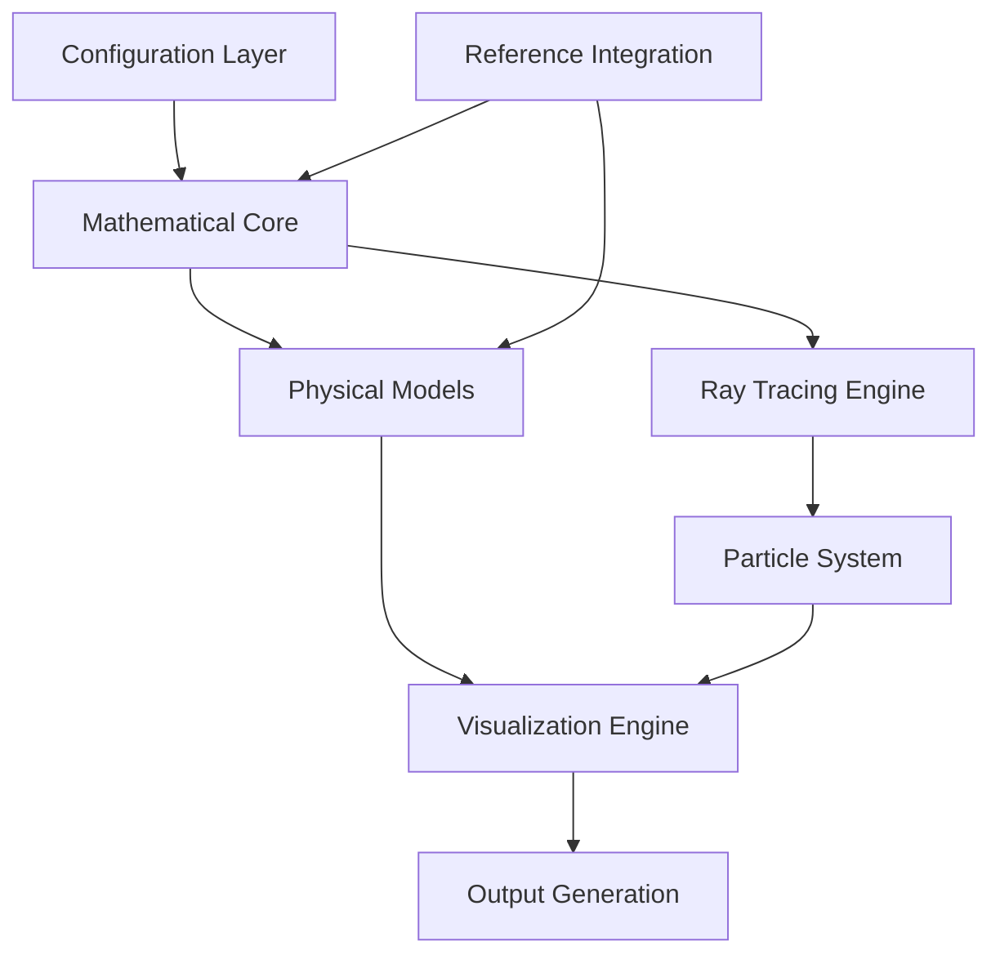

# Design Document

## Overview

This design outlines the enhancement of the existing black hole visualization system to achieve Jean-Pierre Luminet's iconic dot-based black hole representation. The system will consolidate the best features from the reference implementations (bhsim and luminet) while maintaining the current modular architecture and progressively building toward publication-quality visualizations.

The core innovation will be implementing a particle-based rendering system where individual dots represent matter in the accretion disk, with each dot's position accurately calculated using general relativistic ray tracing to show gravitational lensing effects.

## Architecture

### High-Level Architecture



### Module Structure

The enhanced system will maintain the existing modular structure with key improvements:

```
src/
├── core/                    # Core models and abstractions
│   ├── black_hole_model.py  # Enhanced with particle sampling
│   ├── particle_system.py   # NEW: Dot-based representation
│   └── luminet_model.py     # NEW: Luminet-specific implementation
├── math/                    # Mathematical computations
│   ├── ray_tracing.py       # NEW: Geodesic calculations
│   ├── lensing_effects.py   # NEW: Gravitational lensing
│   └── particle_physics.py  # NEW: Particle dynamics
├── visualization/           # Rendering and plotting
│   ├── luminet_plotter.py   # NEW: Dot-based visualization
│   ├── particle_renderer.py # NEW: Particle rendering engine
│   └── progressive_enhancer.py # NEW: Quality improvement system
└── integration/             # NEW: Reference consolidation
    ├── bhsim_adapter.py     # Adapter for bhsim features
    └── luminet_adapter.py   # Adapter for luminet features
```

## Components and Interfaces

### 1. Enhanced Black Hole Model

**Purpose**: Extend the existing BlackHole class to support particle-based visualization while maintaining backward compatibility.

**Key Enhancements**:
- Particle sampling system for accretion disk representation
- Integration with ray tracing engine
- Support for both continuous (current) and discrete (Luminet) representations

```python
class EnhancedBlackHole(BlackHole):
    def __init__(self, config, mass, inclination, accretion_rate, particle_count=10000):
        super().__init__(config, mass, inclination, accretion_rate)
        self.particle_system = ParticleSystem(self, particle_count)
        self.ray_tracer = RayTracingEngine(self)
        
    def sample_particles(self, density_function=None):
        """Sample particles from accretion disk with configurable density"""
        
    def calculate_lensed_positions(self):
        """Calculate apparent positions of all particles including lensing"""
```

### 2. Particle System

**Purpose**: Manage the discrete representation of matter in the accretion disk as individual particles/dots.

**Key Features**:
- Configurable particle density and distribution
- Physical properties (position, velocity, temperature, flux)
- Efficient spatial indexing for performance

```python
class ParticleSystem:
    def __init__(self, black_hole, particle_count, distribution='biased_center'):
        self.particles = []
        self.distribution_type = distribution
        
    def generate_particles(self):
        """Generate particles with realistic distribution"""
        
    def apply_physics(self):
        """Apply physical properties (temperature, flux, etc.)"""
```

### 3. Ray Tracing Engine

**Purpose**: Implement accurate geodesic calculations for photon paths around the black hole.

**Key Capabilities**:
- Solve geodesic equations in Schwarzschild/Kerr spacetime
- Handle multiple image orders (direct, ghost images)
- Efficient numerical integration methods

```python
class RayTracingEngine:
    def __init__(self, black_hole):
        self.black_hole = black_hole
        self.solver_params = black_hole.config['ray_tracing_params']
        
    def trace_photon_path(self, source_position, observer_position):
        """Trace photon path from source to observer"""
        
    def calculate_impact_parameter(self, radius, angle, image_order=0):
        """Calculate impact parameter for given source position"""
```

### 4. Luminet Plotter

**Purpose**: Specialized visualization engine for dot-based black hole representation.

**Key Features**:
- Render particles as individual dots with appropriate sizing
- Apply brightness and color mapping based on physical properties
- Progressive quality enhancement system

```python
class LuminetPlotter(BasePlotter):
    def __init__(self, config):
        super().__init__(config)
        self.dot_renderer = ParticleRenderer(config)
        
    def plot_luminet_style(self, black_hole, quality_level='standard'):
        """Generate Luminet-style dot visualization"""
        
    def enhance_quality(self, current_plot, enhancement_level):
        """Progressively improve visualization quality"""
```

### 5. Reference Integration Layer

**Purpose**: Consolidate the best mathematical models and algorithms from reference implementations.

**Integration Strategy**:
- Extract core algorithms from bhsim and luminet references
- Create adapter classes to maintain compatibility
- Unified interface for accessing reference functionality

## Data Models

### Particle Data Structure

```python
@dataclass
class Particle:
    # Spatial coordinates
    radius: float           # Radial position in accretion disk
    angle: float           # Angular position
    
    # Physical properties
    temperature: float     # Local temperature
    flux: float           # Observed flux
    redshift_factor: float # Gravitational redshift
    
    # Observed coordinates (after lensing)
    impact_parameter: float
    observed_x: float
    observed_y: float
    
    # Image properties
    image_order: int      # 0=direct, 1=ghost, etc.
    brightness: float     # Rendered brightness
    color: tuple         # RGB color values
```

### Configuration Schema

```python
luminet_config = {
    "particle_system": {
        "particle_count": 10000,
        "distribution_type": "biased_center",  # or "uniform", "custom"
        "min_radius_factor": 6.0,  # in units of M
        "max_radius_factor": 50.0,
        "density_bias_exponent": 2.0  # bias toward center
    },
    "ray_tracing": {
        "solver_method": "runge_kutta",
        "integration_steps": 1000,
        "precision_tolerance": 1e-8,
        "max_image_orders": 2  # direct + ghost
    },
    "luminet_visualization": {
        "dot_size_range": (0.1, 2.0),
        "brightness_scaling": "logarithmic",
        "color_scheme": "temperature",  # or "redshift", "flux"
        "background_color": "black",
        "quality_levels": ["draft", "standard", "high", "publication"]
    }
}
```

## Error Handling

### Numerical Stability
- Implement robust error checking for geodesic integration
- Handle edge cases near the event horizon
- Graceful degradation for failed ray tracing calculations

### Performance Optimization
- Spatial indexing for efficient particle queries
- Parallel processing for independent ray tracing calculations
- Memory management for large particle systems

### Validation Framework
- Unit tests for mathematical functions against analytical solutions
- Regression tests comparing with reference implementations
- Visual validation tools for comparing output quality

## Testing Strategy

### Unit Testing
- Mathematical functions (geodesic calculations, impact parameters)
- Particle system operations (generation, physics application)
- Ray tracing accuracy against known solutions

### Integration Testing
- End-to-end visualization pipeline
- Compatibility with existing plotting functions
- Performance benchmarks for different particle counts

### Visual Validation
- Comparison tools with reference implementations
- Quality metrics for Luminet-style output
- Progressive enhancement validation

### Reference Benchmarking
- Accuracy comparison with bhsim results
- Feature parity validation with luminet implementation
- Performance profiling against reference code

## Implementation Phases

### Phase 1: Foundation Enhancement
- Extend existing BlackHole model with particle support
- Implement basic ParticleSystem class
- Create RayTracingEngine with core geodesic calculations

### Phase 2: Luminet Visualization
- Develop LuminetPlotter with dot-based rendering
- Implement particle-to-dot conversion pipeline
- Basic quality enhancement system

### Phase 3: Reference Integration
- Create adapter classes for bhsim and luminet features
- Consolidate mathematical models
- Comprehensive testing and validation

### Phase 4: Quality Optimization
- Advanced rendering techniques
- Performance optimization
- Publication-quality output capabilities

## Performance Considerations

### Computational Complexity
- Ray tracing: O(n × m) where n=particles, m=integration_steps
- Particle generation: O(n) where n=particle_count
- Rendering: O(n) where n=visible_particles

### Memory Usage
- Particle storage: ~100 bytes per particle
- 10,000 particles ≈ 1MB memory footprint
- Configurable particle count for different use cases

### Optimization Strategies
- Vectorized operations using NumPy
- Parallel processing for independent calculations
- Efficient data structures for spatial queries
- Progressive rendering for interactive use

This design provides a solid foundation for achieving Luminet's iconic black hole visualization while maintaining the flexibility and modularity of your existing system.